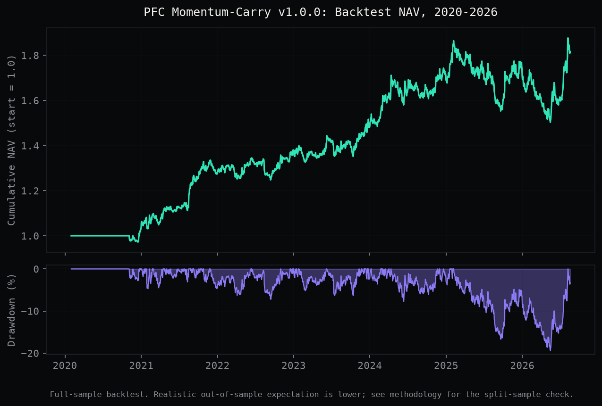

# PFC Momentum-Carry


A dollar-neutral, cross-sectional long/short strategy on liquid Binance USDT-M perpetuals, combining price momentum and funding-rate carry. Deterministic V1, no ML yet. Runs autonomously via cron, publishes a SHA-256-hashed signal daily before the outcome is known.

**Live dashboard**: [amitrathore.io/system](https://amitrathore.io/system)
**Full methodology**: [methodology.md](./methodology.md)

---

## Backtest performance (2020-2026)



| Metric | Value |
|---|---|
| Sharpe (full sample) | 0.858 |
| Newey-West t-stat | 2.16 |
| 90% bootstrap CI (Sharpe) | [0.22, 1.48] |
| Max drawdown | -19.38% |
| Avg daily turnover | 19.1% |

**The honest read**: the bootstrap CI technically excludes zero, but only barely. A split-sample check shows the strategy's edge has decayed over time, and the true out-of-sample recent-period Sharpe (0.6-0.7) does not clearly clear statistical significance on its own. Published anyway, because the point of this system is process, not a green number. Full reasoning in [methodology.md](./methodology.md).

---

## How it runs


Runs daily at 00:10 UTC via cron. No manual intervention. Every signal is hashed and committed before its outcome is known, so the history can't be quietly rewritten after the fact.

---

## Repository structure

```
pipeline/
  build_universe.py      # point-in-time liquid perp universe
  backfill.py             # full historical data pull
  refresh_data.py         # incremental daily update (not a full re-pull)
  backtest.py              # strategy engine + Newey-West + bootstrap validation
  split_sample_check.py    # out-of-sample weight validation
  generate_signal.py       # daily signal generation, idempotent, hashed
  generate_charts.py       # this chart
methodology.md             # full versioned strategy spec
signals.jsonl               # append-only, hash-verified signal history
universe_snapshot.json      # current tradable universe
```

---

Open to crypto research, trading/portfolio management, and quantitative analysis contract work. **[Get in touch](https://amitrathore.io/#contact)**
